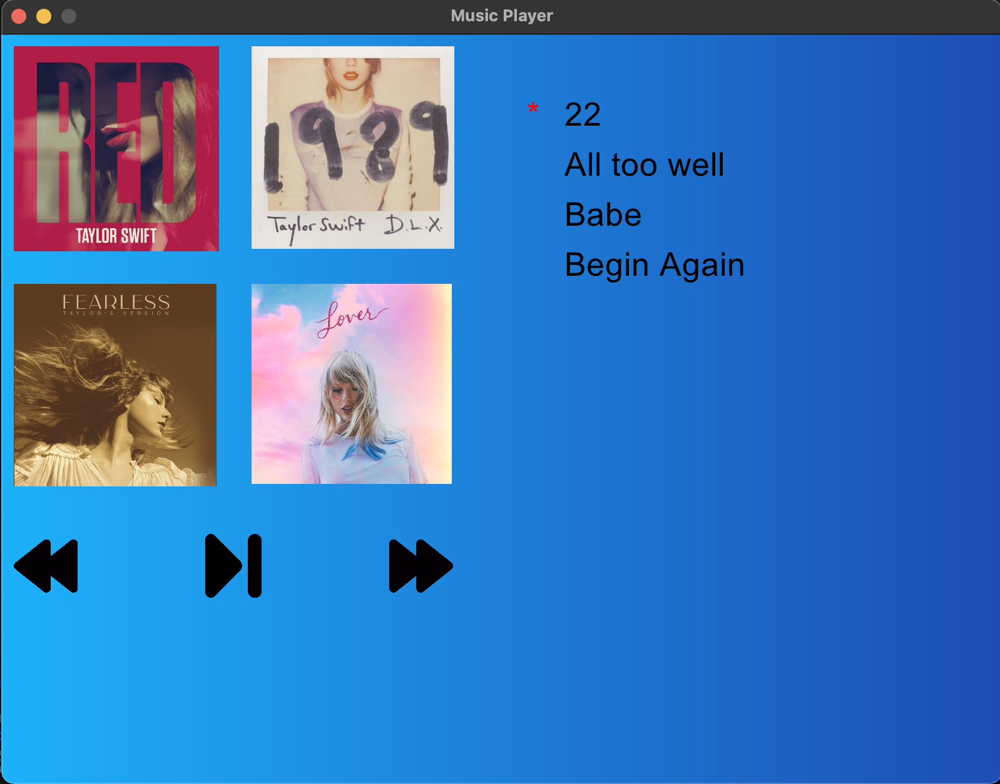

# Simple Music GUI
## About the Project
Simple Music GUI is a project built using Ruby and the Gosu library. This project aims to simulate a seamless and enjoyable music playback experience with an easy-to-use interface. 

Features:
* User-Friendly Interface: A clean and intuitive GUI that allows users to navigate through their music library effortlessly.
* Play, Pause, and Skip: Control playback with ease. Play, pause, and skip tracks at your convenience.
* Playlist management: Musics are packed into playlist

## Built With
* 

## Installations
1. Clone repo
```sh
git clone [URL]
```
2. Install dependencies
```sh
gem install gosu
```
3. Run the project
```sh
ruby gui_music_player.rb
```

## App ScreenShot


## License

Distributed under the MIT License. See `LICENSE.txt` for more information.
